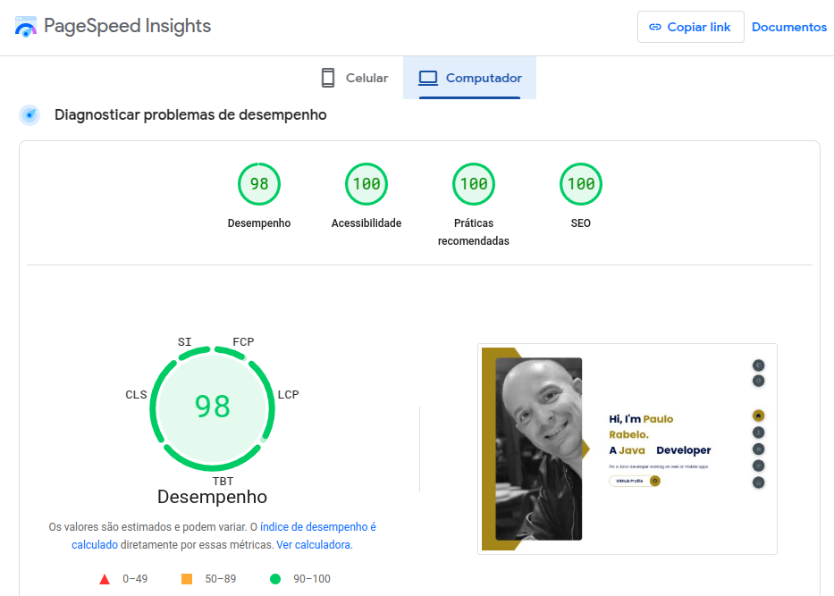

# Paulo Rabelo - Portfólio Pessoal


> **Live Demo:** [paulorabelo.dev.br](https://paulorabelo.dev.br)

Olá! Bem-vindo ao repositório do meu **site portfólio pessoal**. Aqui você encontrará informações sobre o projeto, tecnologias utilizadas, funcionalidades implementadas e meus projetos em destaque.

## 🚀 Tecnologias Utilizadas

| Tecnologia | Finalidade |
|------------|------------|
| **HTML5** | Estrutura semântica e acessível |
| **CSS3 / SASS** | Estilização avançada, variáveis, mixins, responsividade |
| **JavaScript (ES6+)** | Interatividade, DOM manipulation, fetch API |
| **Bootstrap 5** | Grid system, componentes responsivos, utilitários |
| **EmailJS** | Formulário de contato sem backend |
| **Vercel** | Deploy contínuo, HTTPS, CDN global, preview deploys |

## ✨ Funcionalidades

| Funcionalidade | Descrição | Tecnologia |
|----------------|-----------|------------|
| **Tema Dia/Noite** | Alternância completa com persistência em localStorage | JavaScript + CSS Custom Properties |
| **Multi-idioma** | Suporte a PT-BR / EN / ES com detecção automática | JavaScript + JSON de traduções |
| **Formulário de Contato** | Envio direto via EmailJS (sem backend) | EmailJS SDK |
| **Responsivo** | Mobile-first, breakpoints Bootstrap + customizados | CSS Grid/Flexbox + Media Queries |
| **Performance** | Otimizado para Core Web Vitals (PageSpeed 90+) | Minificação, lazy loading, cache |
| **SEO Friendly** | Meta tags, Open Graph, sitemap, robots.txt | HTML semântico |

## 📱 Layouts

### Desktop
| Home | Projetos |
|------|----------|
|  |  |

### Mobile
| Home | Menu |
|------|------|
|  |  |

### Performance (PageSpeed Insights)


## 🛠️ Como Executar Localmente

### Pré-requisitos
- Node.js (para SASS compilation) ou VS Code com extensão Live Sass Compiler
- Navegador moderno

### Passos
```bash
# 1. Clone o repositório
git clone https://github.com/paulorabelo/paulorabelo_site.git

# 2. Entre no diretório
cd paulorabelo_site

# 3. Opção A: Live Server (VS Code) - Recomendado
#    Clique com botão direito no index.html > "Open with Live Server"

# 4. Opção B: Python HTTP Server
python -m http.server 8000
# Acesse http://localhost:8000

# 5. Opção C: Node.js serve
npx serve .
```

### Compilar SASS (se modificar styles)
```bash
# Instalar SASS globalmente (uma vez)
npm install -g sass

# Compilar
sass styles/main.scss styles/main.css

# Ou watch mode
sass --watch styles/main.scss styles/main.css
```

## 📁 Estrutura do Projeto

```
paulorabelo_site/
├── index.html              # Página principal
├── LICENSE                 # Licença MIT
├── README.md               # Este arquivo
├── img/
│   └── assets_readme/      # Screenshots para README
├── js/
│   ├── main.js             # Lógica principal (temas, idiomas, contato)
│   ├── translations.js     # Objetos de tradução PT/EN/ES
│   └── emailjs-config.js   # Configuração do EmailJS
├── styles/
│   ├── main.scss           # SASS principal
│   ├── _variables.scss     # Variáveis de cor, spacing, breakpoints
│   ├── _mixins.scss        # Mixins reutilizáveis
│   ├── _base.scss          # Reset, tipografia, utilitários
│   ├── _components.scss    # Componentes (botões, cards, forms)
│   ├── _layout.scss        # Header, footer, sections
│   └── _themes.scss        # Temas light/dark
└── .github/
    └── workflows/          # Deploy automático Vercel (se configurado)
```

## 👨‍💻 Sobre Mim

**Paulo Rabelo** — Desenvolvedor Full Stack & Entusiasta de IA

- 🎓 **Graduação**: Análise e Desenvolvimento de Sistemas
- 🎓 **Pós-graduação**: Tecnologia Java, Spring Boot, SQL
- 💼 **Experiência**: Backend (Java/Spring), Mobile (Android), Web (JS/React/Angular)
- 🤖 **Foco atual**: IA Generativa, LLMs, Automação, RAG, Agentes Autônomos
- 📍 **Localização**: São Paulo, Brasil

## 🌐 Projetos em Destaque

| Projeto | Descrição | Tech Stack | Link |
|---------|-----------|------------|------|
| **SimplePay** | Backend de pagamentos | Java, Spring Boot | [GitHub](https://github.com/paulorabelo/simplepay) |
| **Alcohol-Gasoline** | Calculadora de abastecimento Android | Java, Android SDK | [GitHub](https://github.com/paulorabelo/alcohol-gasoline) |
| **Rock-Paper-Scissors** | Jogo Jokenpo Android | Java, Android SDK | [GitHub](https://github.com/paulorabelo/rock-paper-scissors) |
| **Terminal AI** | Assistente CLI com IA | Python, Gemini API | [GitHub](https://github.com/paulorabelo/terminal-ai) |
| **Stock Screen** | Full-stack stock screener | Java, Angular, Maven | [GitHub](https://github.com/paulorabelo/project-stock-screen) |

## 🔗 Links Úteis

- 🌐 **Portfólio Online**: [paulorabelo.dev.br](https://paulorabelo.dev.br)
- 📝 **Blog Técnico**: [blog.paulorabelo.dev.com.br](https://blog.paulorabelo.dev.com.br)
- 💼 **LinkedIn**: [linkedin.com/in/paulorabelooficial](https://www.linkedin.com/in/paulorabelooficial/)
- 📧 **E-mail**: [contato@paulorabelo.dev.br](mailto:contato@paulorabelo.dev.br)
- 🏢 **MRGSoft**: [mrgsoft.com.br](https://mrgsoft.com.br)

## 🔮 Roadmap / Em Desenvolvimento

- [ ] **Versão React/Next.js** — Migração para stack moderna com TypeScript, Tailwind, App Router
- [ ] **Blog integrado** — CMS headless ou MDX para posts técnicos
- [ ] **Dashboard de métricas** — Analytics de visitantes, projetos mais visualizados
- [ ] **Modo apresentação** — Para uso em talks/meetups
- [ ] **PWA** — Service Worker, manifest, offline support

## 🤝 Contribuindo

Contribuições são bem-vindas! Como este é um portfólio pessoal, o foco é:
- 🐛 **Bug reports**: Issues com passos para reproduzir
- ✨ **Sugestões de UX/UI**: Melhorias de usabilidade e acessibilidade
- 📝 **Correções de conteúdo**: Typos, links quebrados, info desatualizada
- 🌍 **Traduções**: Novos idiomas ou melhorias nas existentes

### Como contribuir
```bash
# 1. Fork o projeto
# 2. Crie sua branch (git checkout -b feature/minha-melhoria)
# 3. Commit suas mudanças (git commit -m 'feat: descrição da melhoria')
# 4. Push para a branch (git push origin feature/minha-melhoria)
# 5. Abra um Pull Request
```

## 📄 Licença

Este projeto está sob a licença **MIT**. Veja o arquivo [LICENSE](LICENSE) para detalhes.

---

<div align="center">
  <sub>Desenvolvido com ☕, 💻 e 🤖 por <strong>Paulo Rabelo</strong></sub><br>
  <sub><a href="https://github.com/paulorabelo">@paulorabelo</a> • <a href="https://paulorabelo.dev.br">Portfólio</a> • <a href="https://blog.paulorabelo.dev.com.br">Blog</a></sub>
</div>
